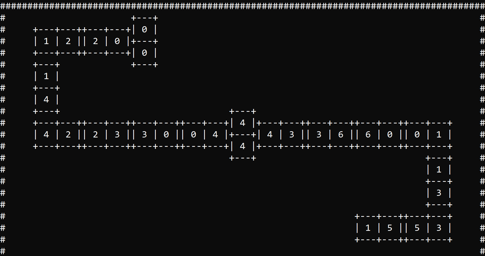
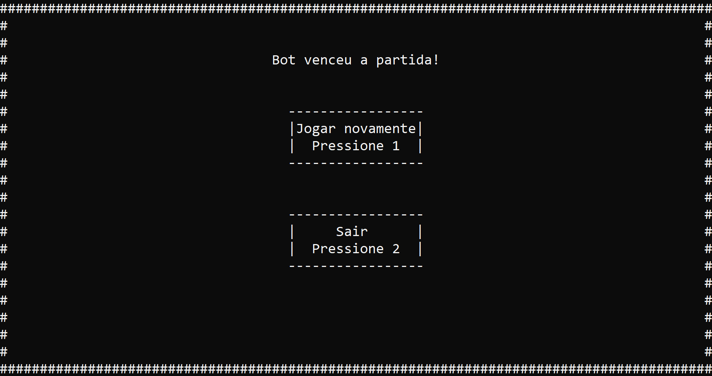

# Dominoes_Game
**Jogo de Dominó desenvolvido em linguagem C em que é possível jogar de 2 a 4 jogadores**

**Dominoes game developed in C language in which it is possible to play from 2 to 4 players**

## Instruções para executar / Instructions to execute 
Para conseguir executar o código é necessário instalar a biblioteca conio.c. Seguir o tutorial do arquivo [Conio.c - Como instalar.txt](Conio.c library/Conio.c - Como instalar.txt) 

To be able to run the code you need to install the library conio.c. Follow the tutorial file [Conio.c - Como instalar.txt](Conio.c library/Conio.c - Como instalar.txt)

## Arquivos / Files
- **Domino.c**: Código onde estão todas as lógicas do jogo e as principais funções utilizadas para o funcionamento da lógica / Code where are all the logics of the game and the main functions used for the operation of the logic 

- **pilha.h**: Biblioteca onde estão as funções da pilha que utiliza lista simplesmente encadeada com alocação dinâmica aplicada para o cava de pedras do dominó / Library where are the functions of the stack that uses linked list with dynamic memory allocation applied to the pile of dominoes stones

- **listade.h**: Biblioteca onde estão as funções da lista duplamente encadeada com alocação dinâmica utilizada para criação da mesa e das mãos dos jogadores / Library where are the functions of the double linked list with dynamic memory allocation used for creating the table and hands of players

## Demonstrações de funcionamento / Operations demonstration
- **Tela inicial / Initial screen**

- **Tela da mesa e das mãos / Table and hands screen**

- **Tela final / Final screen**

